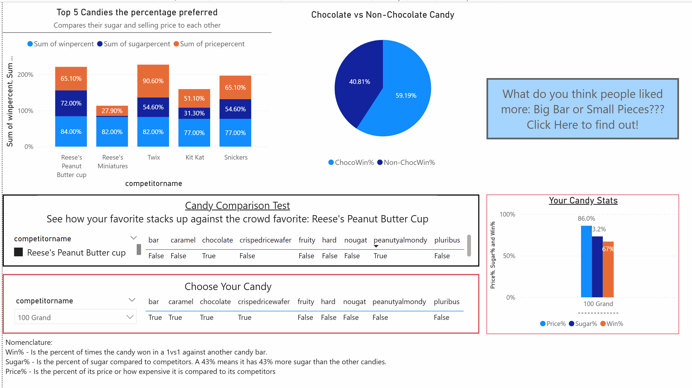

# CandyAnalysis
Practicing python and PowerBi skills with some ETL and analysis on basic candy data
markdown
# Data Engineering: Maven Candy Analysis
A functional ELT (Extract, Load, Transform) project demonstrating data optimization and Power BI dashboarding.

## 📊 Dashboard Preview

## 🚀 Links
- **Project Showcase:** [[LINK](https://app.powerbi.com/view?r=eyJrIjoiMTUwODc5NTItNDUyNi00ZTVmLWE0YzAtNDFmMzgyOGNkYmVhIiwidCI6IjI1Y2UwMjYxLWJiZDYtNDljZC1hMWUyLTU0MjYwODg2ZDE1OSJ9)]

## ⚡ Project Highlights
- **Autonomous Execution:** This project was developed independently, moving from raw data to a finished dashboard with zero-to-minimal AI assistance.
- **Memory Optimization:** Slashed the dataset size by **46.6%** by manually downcasting data types (converting large floats/ints to efficient 8-bit and 32-bit formats).
- **Clean ELT:** Independently engineered a Python script to audit, clean, and export data specifically for BI ingestion.
- **DAX Implementation:** Built custom metrics in Power BI to analyze win rates across different candy categories (Chocolate vs. Fruit, etc.).

## 📁 Files Included
- `candy-data.csv`: The raw source data.
- `candyPractice.py`: My Python cleaning and optimization script.
- `cleanedCandy.csv`: The final, high-performance file ready for Power BI.
